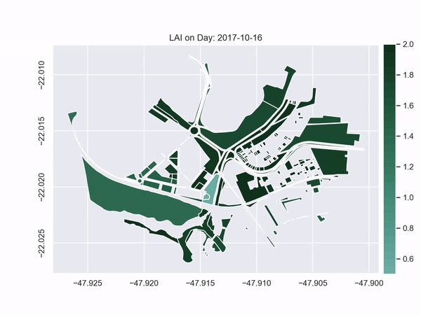

# ggrowtools - Grass Growth Model for Urban Management

  

This package presents a vegetation growth model designed to be used in the Urban Environment, but is expected to work for the grass growth in general.

The model runs in two modes:
SMI | Daylength
------------ | -------------
Based on the Moisture Index (hydrological seasons) | Based on the day lenght
Jun to Aug or Sep to May | daylength > 12 or daylength <= 12

The default mode is 'SMI'.

The model can be applyed to a single area/point or over multiple polygons (using Geopandas and a Shapefile).

Examples of how to run the model are available in [the examples folder](/examples/).
